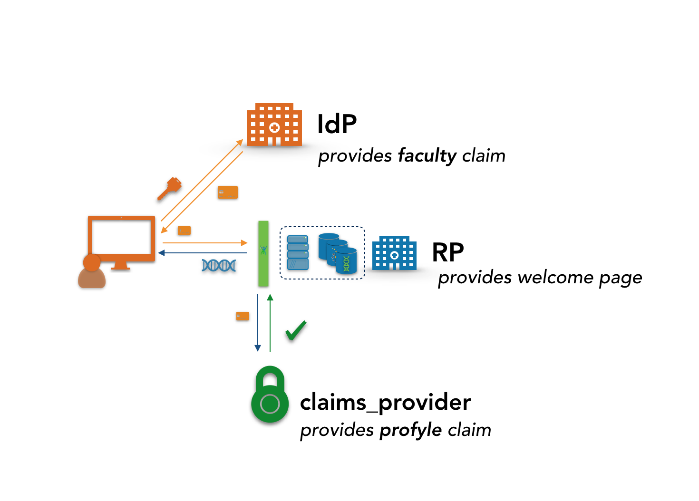

# Simple distributed claims example

A simple distributed claims example using pyoidc.  These are lightly
modified versions of the simple_op/simple_rp example that comes
with pyoidc.

The use demonstrated here is the same as in
[toy_dist_claims](https://github.com/ljdursi/toy_dist_claims), but
using the production [Elixir REMS](http://www.elixir-finland.org/en/aai-rems-2/)
authorization management package.  So the outline is the same as
in that package:



but here, rather than having hard-coded authorizations, the claims
provider itself performs a lookup to the [Elixir REMS
proxy](https://github.com/cscfi/elixir_rems_proxy), which provides
ReST queries to postgres database populated with REMS test data.

To run, add the following lines to `/etc/hosts`:

```
0.0.0.0 idp
0.0.0.0 rp
0.0.0.0 claims_provider
```

Run the services:

```
docker-compose up 
```

(The elixir_rems_proxy service may fail and restart once or twice
while waiting for the postgres database to become available; this is
normal.)

Then proceed to https://rp:8000 (note - self-signed certifcates, may cause some problems) and provide the IdP hostname (idp)

Then log in with:

user: alice pass: alice
* Faculty member
* Project member

user: bob pass: bob
* Faculty member
* Not Project member

user: carl pass: carl
* Not Faculty member
* Not Project member

user: frank pass: frank
* Not Faculty member
* Not Project member

To use the REMS dashboard to examine the DAC-facing authorization service, install
the software (note that you will need to have [Clojure](https://clojure.org) and
[Leiningen](https://leiningen.org) installed):

```
git clone https://github.com/cscfi/rems
cd rems
lein run
lein figwheel
```

and go to http://localhost:3000 to see the dashboard.  Alternately, you can
directly add the authorization to the database for (say) Carl and try logging
in again:

```
curl -X PATCH \
  http://localhost:8080/user/carl \
  -H 'Content-Type: application/json' \
  -d '{
  "user_identifier": "",
  "affiliation": "",
  "datasets": [
    {
      "permissions": [
        {
          "affiliation": "example-org",
          "source_signature": "",
          "url_prefix": "",
          "datasets": [
            "urn:nbn:fi:lb-201403262"
          ]
        }
      ]
    }
  ]
}'
